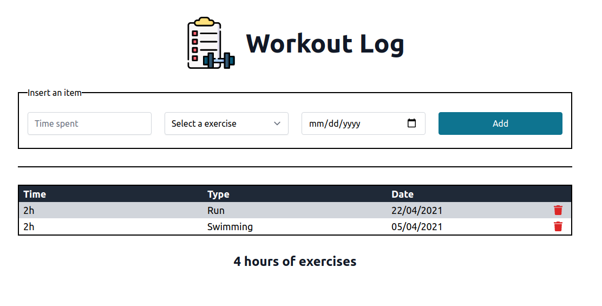

<h1 align="center">Workout Log</h1>
<h4 align="center">
   
</h4>

  <a href="#wrench-built-with">Built With</a>&nbsp;&nbsp;&nbsp;|&nbsp;&nbsp;&nbsp;
  <a href="#page_facing_up-about">About</a>&nbsp;&nbsp;&nbsp;|&nbsp;&nbsp;&nbsp;
  <a href="#-how-to-use">How to Use</a>&nbsp;&nbsp;&nbsp;|&nbsp;&nbsp;&nbsp;
  <a href="#-how-to-contribute">How to Contribute</a>&nbsp;&nbsp;&nbsp;|&nbsp;&nbsp;&nbsp;
  <a href="#pencil-author">Author</a>

## :wrench: Built With

- [NextJS](https://nextjs.org/)
- [TailwindCSS](https://tailwindcss.com/)
- [Storybook](https://storybook.js.org/)
- [Jest](https://jestjs.io/pt-BR/)
- [React Testing Library](https://testing-library.com/)

## :page_facing_up: About

This is a project to manage your exercises hours.

## 💻 How to Use

- Clone the project: `git clone git@github.com:Lukazovic/workout-log-nextjs-tailwindcss.git`;
- Go to the project folder: `cd workout-log-nextjs-tailwindcss`;
- Download the dependencies: `yarn`;

### Start Dev Environment

- Start the application: `yarn dev`.

It will open a browser page go to [http://localhost:3000](http://localhost:3000/).

### Start Product Environment

- Build the production application: `yarn build`.
- Start the application: `yarn start`.

It will open a browser page go to [http://localhost:3000](http://localhost:3000/).

### Run Tests

- Run all tests: `yarn test`.
- Run tests in watch mode: `yarn test:watch`.

### Start Storybook

- Run all tests: `yarn storybook`.

It will open a browser page go to [http://localhost:6006](http://localhost:6006/).

### Generate Components Structure

- To generate a new component run: `yarn generate component #ComponentName`.

> #ComponentName is the name you want to give to your new component

It will be generated on the `./src/components/#ComponentName`.

### Generate Layout Structure

- To generate a new layout run: `yarn generate layout #LayoutName`.

> #LayoutName is the name you want to give to your new layout

It will be generated on the `./src/layouts/#LayoutName`.

## 🤔 How to Contribute

- Fork this repository;
- Create your branch with your feature: `git checkout -b my-feature`;
- Commit your feature: `git commit -m 'feat: My new feature'`;
- Push to your branch: `git push origin my-feature`.

Then merge your pull request, you can now delete your branch

## :pencil: Author

<table>
  <tr>
    <td align="center"><a href="https://github.com/Lukazovic"> <b>Lucas Vieira</b></a> </td>
  <tr>
</table>
